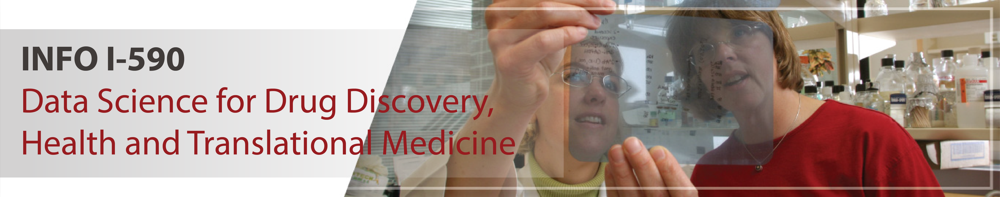
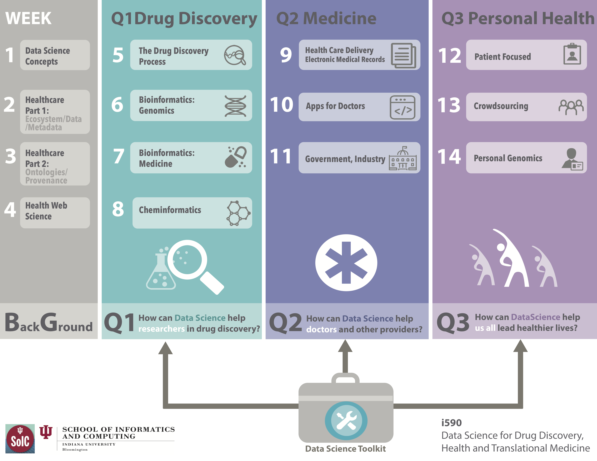

# DSDHT: Data Science for Drug Discovery, Health, and Translational Medicine

INFO_I-590, "Topics in Informatics: Data Science for Drug Discovery,
Health and Translational Medicine". This innovative data science course
was developed and introduced by Prof. Wild in 2013, with major contributions by
Associate Instructor, Abhik Seal.  For 2017 the course was significantly revised, by Prof. Joanne Luciano, assisted by Jeremy Yang and JT Wolohan as associate instructors.

This major revision included a re-conception of the course, which had previously concentrated on drug discovery, and particularly bioinformatics and cheminformatics, to expand the health and medical units, and to serve a diverse student population, generally of two types, either more computationally skilled, or more application and domain oriented.  More concretely, a student in the former category might have strong programming and CS skills, and a student in the latter category might have a strong background in medical or health informatics, but limited programming skills.  Jeremy's role included condensing and updating the previous content on drug discovery to 4 weeks, while Joanne focused on expanding and enriching the previous content on health and medical topics.  This was a challenging task, started in late November 2016, to be completed for the Spring 2017 edition of the course.  We were assisted by instructional designers and online technology specialists, which was very helpful, but required the coordination of a complex team effort.  
The resulting Spring 2017 edition of DSDHT was quite successful in many respects.  After an introductory unit: "Introduction to Data Science and the Healthcare Ecosystem," the original three driving questions were retained:

 - How can data science help researchers find new drugs and reuse old ones?
 - How can data science help providers treat patients better?
 - How can data science help us all lead healthier lives?

DSDHT course concept diagram developed collaboratively with IU instructional designers:

These three units organized the domain knowledge, linked by foundational life sciences, but also all addressable by the methods and tools of data science.  In this way a profoundly vast and diverse knowledge domain was organized and related to data science, with specific, concrete examples and exercises informed by the academic and commercial experiences of the instructors.  DSDHT was offered again in Fall 2017, with minor revisions, mostly to achieve more effective and consistent use of the online learning management system (LMS) Canvas.  One notable feature of DSDHT was the final projects, which involved a process of proposals and refinement, and presentation via report and a "virtual poster session."  These projects were modeled after scholarly or professional research studies.  Several have potential as publishable research, and are available as exemplars by consent of the students.
